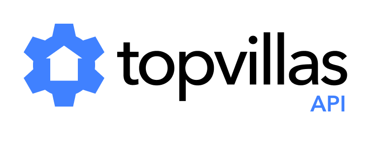

# [Top Villas API](https://thetopvillas.com) for Vacation Rentals

The **[Top Villas API](https://thetopvillas.com)** gives you seamless access to a **world-class portfolio** of over **10,000 premium vacation rental properties** across the globe. Our API delivers both **static listing data**—including property names, descriptions, high-resolution images, and amenities—as well as **live pricing and availability data** to ensure your platform always displays the most up-to-date information.  

## Listing Data

Our listing data provides **rich, high-quality information** to power your platform with detailed property insights.

Each property listing includes:  

- **Property names** – Clear and descriptive names to help customers recognize and remember listings.  
- **Location data** – Precise geolocation details, including address, city, and region, to enhance search and filtering.  
- **Room and bed configurations** – Detailed breakdowns of bedrooms, bed types, and sleeping arrangements for accurate guest capacity planning.  
- **Handwritten descriptions** – Rich, professionally written descriptions.  
- **High-resolution images** – Stunning, high-quality photos that showcase each property’s best features, optimized for web and mobile displays.  
- **Amenity lists** – A curated subset of our available amenities, from Wi-Fi and air conditioning to pools and pet-friendly options.  
- **Real customer reviews** – Authentic guest feedback that helps build trust and improve decision-making for future travelers.  

This dataset provides **everything needed** to create an engaging and informative booking experience. With structured data and **high-quality content**, you can deliver a seamless and visually compelling property browsing experience.

## Live Pricing & Availability

Our pricing and availability API is based on the **[Google Hotel Prices API](https://developers.google.com/hotels/hotel-prices/)** so it's **fast, accurate, and easy to use**.

### Comprehensive & Pre-Calculated Pricing

- Pricing is provided in a **Length of Stay (LOS)** format.  
- You receive **exact prices**, including all taxes and fees, for **every possible booking** in our system.  
- No need for post-processing or price calculations—simply match the customer’s search dates to our data and return the price.  
- Our **incremental update protocol** ensures that you only fetch changes, keeping your requests **small** and your cache  **always up-to-date**.  
- You get **instant, accurate pricing** without the complexity or slow-down of real-time calculations.

## Get Started Today

**API credentials and endpoints are issued upon request.**

[**Contact us**](mailto://info@thetopvillas.com) to unlock direct integration with **[Top Villas'](https://thetopvillas.com)** premium vacation rental database.  

## Developer Documentation

- [Overview](./overview.md)
- [Auth](./auth.md)
- [Listing Data](./static.md)
- [Pricing Data](./pricing.md)
- [Implementation Guide](./guide.md)