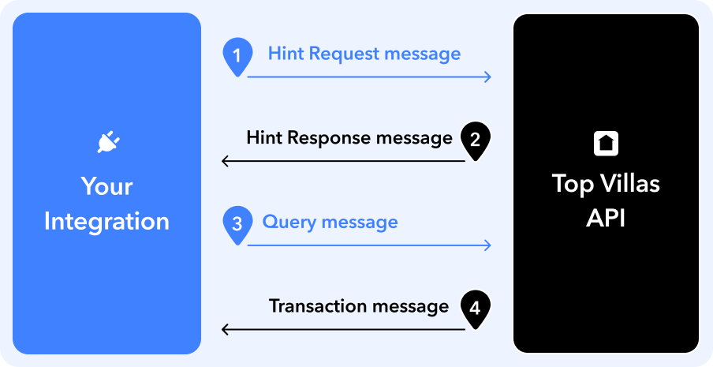

# Live Pricing and Availability

The **Top Villas API** exclusively publishes **Length of Stay (LoS)** pricing data as this is the only format that guarantees unambiguous and accurate price and availability data. We provide data **330 days ahead** for up to **30 nights** for the vast majority of our online bookable vacation rentals.

We allow you to maintain a live view of our pricing and availability dataset using an [incremental update protocol](https://developers.google.com/hotels/hotel-prices/dev-guide/delivery-mode#hints). See the [Integration Guide](./guide.md) for more details.

The full dataset is potentially quite large, so you may choose to receive only a subset of listings, restrict updates based on the latest check-in date, or limit the stay duration to less than the maximum number of nights.

## Length of Stay Pricing (LoSP) Format

Price and availability data in the Top Villas API is presented in Length of Stay Price (LoSP) format. Each bookable vacation can be considered an individual product, uniquely identified by the following properties:

- **Listing ID**
- **Check-In Date**
- **Number of Nights**
- **(Maximum) Guests**

This combination serves as the primary key for an LoSP entry.

The vast majority of properties in the Top Villas portfolio do not vary their price by the number of guests. To prevent a combinatorial explosion of pricing entries, we only publish prices for the base number of guests—this is the lowest price, below which reducing the number of guests does not lower the price. In the vast majority of cases this is equal to the capacity of the listing.

Additionally, an LoSP contains pricing information. At a minimum, it must include a base price, but the Top Villas API also provides additionally fees and taxes:

- **Price**
- **Fees**
- **Taxes**

### Number of Data Points

Check-in dates can be up to **330 days ahead**, and stays can range up to **30 nights**. This gives a theoretical maximum of 9,900 possible bookable vacations per listing. However, in practice, the majority of listings have far fewer. For example, a one-week booking will eliminate approximately 300 potential bookable vacations.

You may choose to not store unavailable bookings, which could significantly reduce the amount of data you need to hold.

## Incremental Update Flow

The diagram below describes the incremental update flow that you will need to implement to integrate with the live pricing and availability API. See the [Integration Guide](./guide.md) for more details.

<p align="center">

</p>

1. You send a Hint Request message to `/api/xml/hint`.
2. The Top Villas API responds with a list of properties and the dates that have updated pricing.
3. Based on this response, you send a Query message to `/api/xml/query`, requesting updated prices for the specified properties and date ranges.
4. The Top Villas API responds with a Transaction message containing the updated pricing data.

It is your responsibility to maintain a cache of the data based on your initial seed data and then the subsequent incremental updates.

## Hint Request and Response Messages

### Hint Request Message

#### Hint Request Endpoint

```bash
POST /api/xml/hint
```

A Hint Request message is sent to the Top Villas API to indicate that you are requesting an update on pricing changes since the last fetch. This message contains a timestamp marking the last time a Hint Request was processed.

#### Example Request

```xml
<?xml version="1.0" encoding="UTF-8" ?>
<HintRequest id="request" timestamp="2023-06-03T22:59:48Z">
  <LastFetchTime>2023-06-03T22:54:40Z</LastFetchTime>
</HintRequest>
```

- **`id`**: A unique identifier for the request.
- **`timestamp`**: The current request timestamp.
- **`LastFetchTime`**: The timestamp of the last successful Hint Request response.

### Hint Response Message

The Top Villas API responds with a Hint message containing a list of properties that have had pricing updates within the requested timeframe. Each item in the response includes a property ID and a date range representing when price changes occurred.

#### Example Response

```xml
<?xml version="1.0" encoding="UTF-8" ?>
<Hint>
  <Item>
    <Property>1</Property>
    <FirstDate>2025-06-01</FirstDate>
    <LastDate>2025-07-06</LastDate>
  </Item>
</Hint>
```

- **`Property`**: The ID of the property that has pricing updates.
- **`FirstDate`**: The earliest check-in date for which a pricing change occurred.
- **`LastDate`**: The latest check-in date for which a pricing change occurred.

### Hint Message Structure

A Hint Response message contains zero or more `<Item>` elements. Each `<Item>` represents a property with updated pricing data and follows this structure:

```xml
<Item>
  <Property>1</Property>
  <FirstDate>2025-06-01</FirstDate>
  <LastDate>2025-07-06</LastDate>
</Item>
```

- Each `<Item>` contains exactly **one** `<Property>` element.
- The `<FirstDate>` and `<LastDate>` indicate the range of check-in dates affected by a pricing change.
- If no properties have updated pricing, the Hint Response will contain no `<Item>` elements.

## Query and Transaction Messages

### Query Message

After receiving a Hint Response containing an `<Item>` element indicating a property has pricing updates, you send a Query message to the Top Villas API to request updated pricing data.

#### Query Endpoint

```bash
POST /api/xml/query
```

#### Example Query Request

```xml
<?xml version="1.0" encoding="UTF-8"?>
<Query hintId="e6f659056b884872b767439ca66a3711">
  <FirstDate>2025-06-01</FirstDate>
  <LastDate>2025-07-06</LastDate>
  <Nights>30</Nights>
  <PropertyList>
    <Property>1</Property>
  </PropertyList>
</Query>
```

### Query Parameters

- **`hintId`**: A unique identifier linking this query to a previous Hint Request for tracing purposes. The Top Villas API currently ignores this.
- **`FirstDate`**: The earliest check-in date for which pricing data is requested.
- **`LastDate`**: The latest check-in date for which pricing data is requested.
- **`Nights`**: The total number of nights for each check-in date in the range. The maximum value is **30**, but you can specify a lower number based on your maximum length of stay.
- **`PropertyList`**: A list of properties for which pricing is requested. Each `<Property>` element corresponds to a single property ID.

### Transaction Message

The Top Villas API responds to a Query message with a Transaction message containing the updated pricing data for the requested properties and dates.

#### Example Transaction Response

```xml
<?xml version="1.0" encoding="UTF-8"?>
<Transaction xmlns:xsi="http://www.w3.org/2001/XMLSchema-instance" xmlns:xsd="http://www.w3.org/2001/XMLSchema" timestamp="2025-01-30T16:33:44.95672Z" id="3cc0dd1ebdf346fd8e6a4bc5c7b74fec">
  <Result>
    <Property>1</Property>
    <Checkin>2025-06-01</Checkin>
    <Nights>1</Nights>
    <Occupancy>2</Occupancy>
    <Unavailable>
      <NoVacancy/>
    </Unavailable>
  </Result>
  ...
  <Result>
    <Property>1</Property>
    <Checkin>2025-06-01</Checkin>
    <Nights>5</Nights>
    <Baserate currency="USD">5600.00</Baserate>
    <Tax currency="USD">837.00</Tax>
    <OtherFees currency="USD">846.30</OtherFees>
    <Occupancy>26</Occupancy>
  </Result>
  ...
</Transaction>
```

### Transaction Parameters

- **`timestamp`**: The time at which the response was generated.
- **`id`**: A unique identifier for the transaction response.
- **Each `<Result>` element** represents a unique check-in date and stay duration:
  - **`Property`**: The ID of the property for which pricing data is returned.
  - **`Checkin`**: The specific check-in date for which the pricing applies.
  - **`Nights`**: The length of stay for the given check-in date.
  - **`Occupancy`**: The maximum number of guests that the rate applies to.
  - **`Unavailable`**: If present, indicates that no booking is available for the specified stay.
  - **`Baserate`**: The base cost of the stay, in the specified currency.
  - **`Tax`**: Any applicable taxes for the stay.
  - **`OtherFees`**: Additional fees associated with the stay.

**Although each individual item has it's own currency, it is safe to assume that all values given for a single property will be in the same currency.** So you can store the currency at the Property level.

## Google References

- [Google Vacation Rentals Changed Pricing Delivery Mode](https://developers.google.com/hotels/hotel-prices/dev-guide/delivery-mode#hints).
- [Hint and Query Messages](https://developers.google.com/hotels/hotel-prices/xml-reference/queries)
- [Hint Request XSD](./xsd/hint_request.xsd)
- [Hint XSD](https://www.gstatic.com/ads-travel/hotels/api/hint.xsd)
- [Query XSD](https://www.gstatic.com/ads-travel/hotels/api/query.xsd)
- [Transaction Messages](https://developers.google.com/hotels/hotel-prices/xml-reference/transaction-messages)
- [Transaction XSD](https://www.gstatic.com/ads-travel/hotels/api/transaction.xsd)